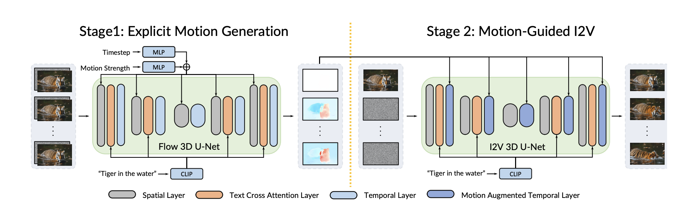

<div align="center">

## Motion-I2V: Consistent and Controllable Image-to-Video Generation with Explicit Motion Modeling
by *Xiaoyu Shi<sup>1\*</sup>, Zhaoyang Huang<sup>1\*</sup>, Fu-Yun Wang<sup>1\*</sup>, Weikang Bian<sup>1\*</sup>, Dasong Li <sup>1</sup>, Yi Zhang<sup>1</sup>, Manyuan Zhang<sup>1</sup>, Ka Chun Cheung<sup>2</sup>, Simon See<sup>2</sup>, Hongwei Qin<sup>3</sup>, Jifeng Dai<sup>4</sup>, Hongsheng Li<sup>1</sup>* 

*<sup>1</sup>CUHK-MMLab   <sup>2</sup>NVIDIA   <sup>3</sup>SenseTime  <sup>4</sup>  Tsinghua University*
</div>


```bib
@article{shi2024motion,
            title={Motion-i2v: Consistent and controllable image-to-video generation with explicit motion modeling},
            author={Shi, Xiaoyu and Huang, Zhaoyang and Wang, Fu-Yun and Bian, Weikang and Li, Dasong and Zhang, Yi and Zhang, Manyuan and Cheung, Ka Chun and See, Simon and Qin, Hongwei and others},
            journal={SIGGRAPH 2024},
            year={2024}
            }
}
```


<div style="text-align: center;">
  
            Overview of Motion-I2V. The first stage of Motion-I2V targets at deducing the motions that can plausibly animate
the reference image. It is conditioned on the reference image and text prompt, and predicts the motion field maps between
the reference frame and all the future frames. The second stage propagates reference image’s content to synthesize frames. A
novel motion-augmented temporal layer enhances 1-D temporal attention with warped features. This operation enlarges the
temporal receptive field and alleviates the complexity of directly learning the complicated spatial-temporal patterns.
</div>


## Usage

1. Install environments
```shell
conda env create -f environment.yaml
```
2. Download models
```shell
git clone https://huggingface.co/wangfuyun/Motion-I2V
```
3. Run the code
```shell
python -m scripts.app 
```
